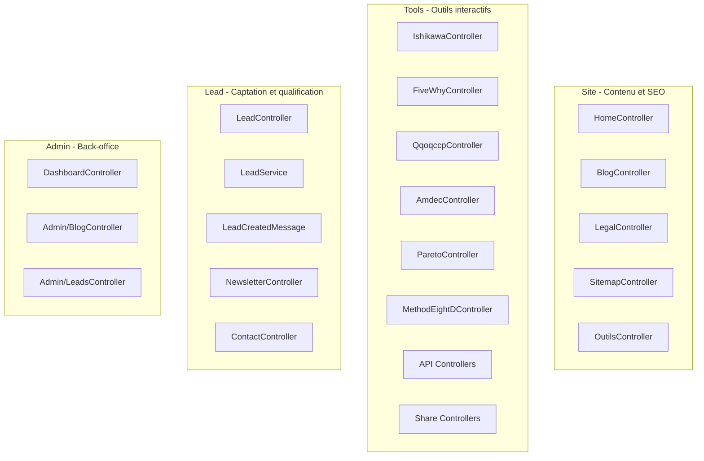

# Plan de refactoring BMAD Architecture

**Vue d’ensemble :** Réorganisation du projet selon les principes BMAD (Site, Tools, Lead), centralisation des assets, intégration Brevo, amélioration de l’architecture asynchrone. Compatible o2switch.

---

## Architecture cible



---

## Phase 0 : Intégration Brevo (Marketing Automation)

### 0.1 Installation

```bash
composer require symfony/brevo-mailer
```

### 0.2 Configuration

**.env / .env.local :**
```env
BREVO_API_KEY=votre-cle-api-brevo
MAILER_DSN=brevo+api://${BREVO_API_KEY}@default
```

### 0.3 Services à créer

- **BrevoSyncService** (`src/Lead/Infrastructure/Brevo/BrevoSyncService.php`) : synchronisation des leads et abonnés newsletter avec l’API Brevo (contacts, listes, attributs).
- **SyncLeadToBrevoMessage** + **SyncLeadToBrevoMessageHandler** : message Messenger pour sync async après création d’un lead.
- **BrevoMailerService** (optionnel) : envoi via templates Brevo (confirmation outil, lead qualifié, newsletter).

### 0.4 Intégration dans le flux existant

- Dans **LeadCreatedMessageHandler** : après création du lead, dispatcher **SyncLeadToBrevoMessage** (async).
- Compléter les TODOs : email de confirmation utilisateur et notification admin (via Brevo ou MailerService actuel).

### 0.5 Documentation

- Mettre à jour `bmad/integration-points.md` : section Brevo (API, listes, attributs, templates).

---

## Phase 1 : Réorganisation des namespaces PHP

### 1.1 Structure cible

```
src/
├── Site/Controller/     (Home, Blog, Legal, Sitemap, Outils, ToolSeo)
├── Tools/Controller/    (Ishikawa, FiveWhy, Qqoqccp, Amdec, Pareto, MethodEightD)
├── Tools/Api/           (API des outils)
├── Tools/Share/         (Share controllers)
└── Lead/Controller/     (Lead, Newsletter, Contact)
    Lead/Application/, Domain/, Infrastructure/ (déjà en place)
```

### 1.2 Actions

- Déplacer les contrôleurs listés vers les namespaces Site, Tools, Lead.
- Mettre à jour namespaces et `use` ; garder les routes telles quelles.
- Alias dans `config/services.yaml` si besoin pendant la migration.

---

## Phase 2 : Centralisation des assets JavaScript

### 2.1 Structure cible

```
assets/js/
├── site/          (home.js, blog-markdown.js)
├── tools/
│   ├── ishikawa/  (controller.js, diagram.js)
│   ├── fivewhy/
│   └── ...
├── lead/
└── shared/        (main.js)
```

### 2.2 Actions

- Déplacer les scripts depuis `public/js/` vers `assets/js/` par domaine.
- Introduire des contrôleurs Stimulus par outil.
- Mettre à jour les templates (asset(), data-controller).

---

## Phase 3 : Restructuration des styles SCSS

### 3.1 Structure cible

```
assets/styles/
├── core/ | layout/ | components/  (inchangés)
├── site/       (home.scss, blog.scss, legal.scss)
├── tools/      (ishikawa.scss, five-why.scss, ...)
├── lead/       (forms.scss, newsletter.scss)
└── admin/
```

### 3.2 Actions

- Déplacer les SCSS depuis `pages/` vers `site/`, `tools/`, `lead/`.
- Ajuster les imports dans `app.scss` et `symfonycasts_sass.yaml`.

---

## Phase 4 : Amélioration de Messenger (async)

### 4.1 Nouveaux messages

- LeadScoringMessage, LeadQualificationMessage, LeadEnrichmentMessage.

### 4.2 Handlers et routing

- Créer les handlers ; ajouter le routing dans `messenger.yaml` vers `async`.

### 4.3 LeadCreatedMessageHandler

- Implémenter les TODOs (email confirmation, notification admin), en s’appuyant sur Brevo (Phase 0) ou le MailerService actuel.

---

## Phase 5 : Préparation points d’entrée IA

- Interfaces métier (ex. ToolAnalysisInterface).
- DTOs par outil dans `src/Tools/Dto/`.
- Endpoint `/api/tools/{tool}/suggest` (préparé, non implémenté).

---

## Phase 6 : Documentation BMAD

- Mettre à jour `bmad/architecture.md`, créer `bmad/migration-guide.md`, ajouter une section Architecture dans `README.md`.

---

## Ordre d’exécution recommandé

1. Phase 0 (Brevo)
2. Phase 1 (namespaces)
3. Phase 3 (SCSS)
4. Phase 2 (JS)
5. Phase 4 (Messenger)
6. Phase 5 (IA)
7. Phase 6 (doc)

---

## Estimation

| Phase | Durée |
| ----- | ----- |
| 0 – Brevo | 2–3 h |
| 1 – Namespaces | 2–3 h |
| 2 – JS | 2–3 h |
| 3 – SCSS | 1–2 h |
| 4 – Messenger | 1–2 h |
| 5 – IA | 1 h |
| 6 – Doc | 30 min |
| **Total** | **9–14 h** |

---

## Points d’attention

- **o2switch :** pas de changement d’infra ; Brevo en API HTTPS ; clés en env.
- **Non-régression :** routes inchangées ; tests à faire passer après chaque phase.
